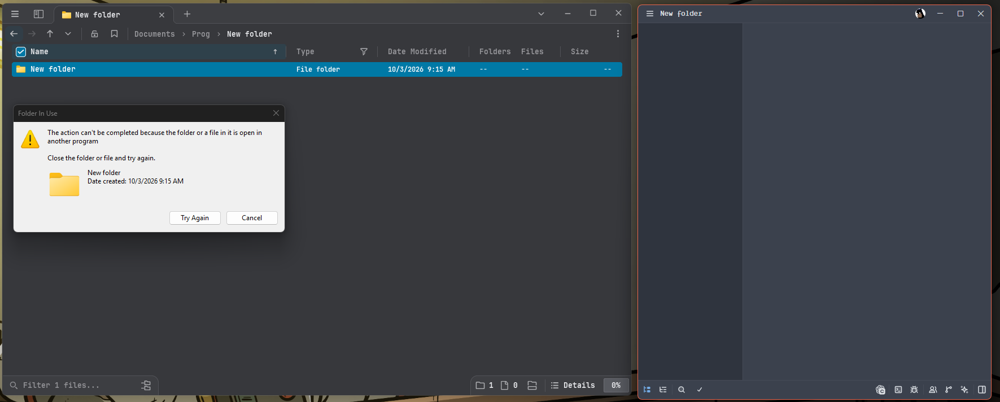
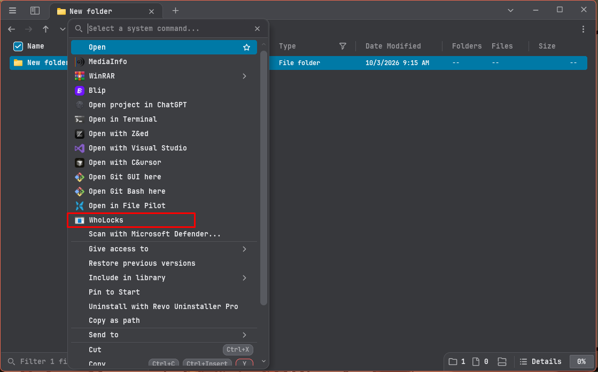
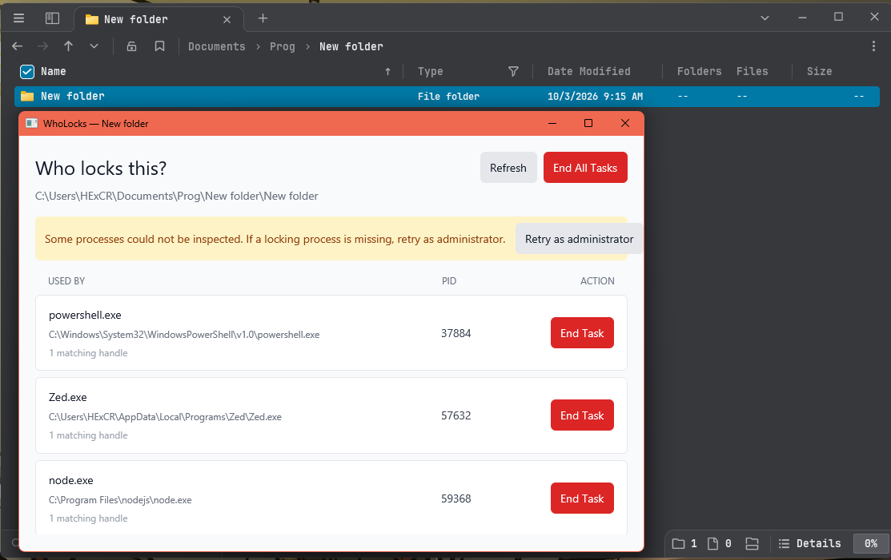

# WhoLocks

**Find the Windows process that is preventing you from moving, renaming, or deleting a file or folder.**

WhoLocks is a lightweight Windows utility that scans open file-system handles and shows exactly which processes are using the selected path. Use it from **File Explorer** through a convenient context-menu command, or run it directly from the command line.

## Features

- **Scan files and folders** directly from the Windows File Explorer context menu.
- Identify each locking process by its **name, executable path, and PID**.
- Detect handles to the selected folder and items anywhere inside it.
- Refresh results without reopening the application.
- End one locking process or all listed processes after a confirmation prompt.
- Retry the scan with **administrator privileges** when Windows blocks access to protected processes.
- Use the graphical application or the standalone command-line tool.

## Quick start

### 1. Install WhoLocks

Download **`WhoLocks-Setup-v0.9.0.exe`** from the [latest GitHub release](https://github.com/HexCore99/wholocks/releases/latest), then run the installer.

**The installation is per-user and does not require administrator privileges.** Windows SmartScreen may display a warning because the installer is not code-signed.

### 2. Select the locked file or folder

When Windows reports that an action cannot be completed because a file or folder is open in another program, locate and select that item in File Explorer.



### 3. Open WhoLocks

Right-click the selected item and choose **WhoLocks**.

> **Windows 11:** If the command is not visible in the modern context menu, choose **Show more options**, then select **WhoLocks**.



### 4. Review the locking processes

WhoLocks displays every process it can identify, including the process name, executable location, PID, and number of matching handles.



Whenever possible, **close the listed application normally** so it can save its work and shut down cleanly. Use **End Task** for one process or **End All Tasks** only when necessary.

> [!CAUTION]
> **Ending a task stops it immediately. Unsaved work may be lost.** Always review the listed processes before confirming.

## Command-line usage

Run these commands from the repository root. Replace the example path with the file or folder you want to inspect.

### Scan a path

```powershell
cargo run -- "C:\path\to\file-or-folder"
```

The command prints each matching process, its PID, and the exact handle path.

### Scan and terminate locking processes

```powershell
cargo run -- --kill "C:\path\to\file-or-folder"
```

> [!WARNING]
> **`--kill` forcibly terminates every distinct process found by the scan.** The affected applications do not get an opportunity to save unsaved work or clean up resources.

## Build from source

### Requirements

- **Windows x64**
- A current [Rust toolchain](https://www.rust-lang.org/tools/install) with the MSVC target
- PowerShell

Clone the repository and build both executables:

```powershell
git clone https://github.com/HexCore99/wholocks.git
cd wholocks
cargo build --release --bins
```

The build produces:

- **`target\release\wholocks.exe`** — command-line application
- **`target\release\wholocks-gui.exe`** — graphical File Explorer application

Run either executable directly:

```powershell
.\target\release\wholocks.exe "C:\path\to\file-or-folder"
.\target\release\wholocks-gui.exe "C:\path\to\file-or-folder"
```

## Add WhoLocks to File Explorer from source

After building the release executables, register the context-menu command for the current Windows user:

```powershell
.\scripts\install-shell-verb.ps1
```

Alternatively, use the built-in CLI command:

```powershell
.\target\release\wholocks.exe --install-context-menu
```

This adds the following per-user registry entry and does not require administrator privileges:

```text
HKCU\Software\Classes\AllFilesystemObjects\shell\WhoLocks
```

> [!IMPORTANT]
> The registration points to the current location of **`wholocks-gui.exe`**. Do not move or delete the release executables after registering the context menu.

To remove the source-installed context-menu command, run either:

```powershell
.\scripts\uninstall-shell-verb.ps1
```

```powershell
.\target\release\wholocks.exe --uninstall-context-menu
```

If you used the setup program, uninstall **WhoLocks** through Windows **Installed apps** instead.

## Administrator access

A normal scan is intentionally performed without elevation. Windows may prevent WhoLocks from inspecting handles owned by protected or higher-privilege processes.

If the expected process is missing, select **Retry as administrator** in the application and approve the Windows User Account Control prompt. Elevated access improves visibility, but some system-protected processes may still be inaccessible.

## How it works

WhoLocks enumerates Windows system handles, safely duplicates candidate handles for inspection, filters them to disk-backed handles, and compares their native device paths with the selected file or folder. Folder scans also match handles to files and subfolders beneath the selected directory.

The application excludes its own process from scan results. Normal scans are **read-only and non-destructive**; a process is terminated only after an explicit GUI confirmation or use of the CLI **`--kill`** option.

## Support

Found a bug or have a feature request? [Open an issue](https://github.com/HexCore99/wholocks/issues).
